<h1 align="center">Hi, I'm Hazar 👋</h1>

<p align="center">
  MEng in Energy Engineering • Physics Graduate • Software & Game Developer
</p>

<p align="center">
  Interested in software development, renewable energy systems, machine learning, and practical engineering solutions.
</p>

---

## ⭐ About Me

I am a developer with a background in physics and energy engineering, interested in building practical software solutions across engineering, data-driven systems, and interactive applications.

My main areas of interest include:

- Software development
- Renewable energy systems
- Machine learning applications
- Game development
- Full-stack web development

I enjoy working on projects that combine analytical thinking, engineering knowledge, and software design.

---

## ⭐ Tech Stack

**Languages**  
Python • JavaScript • TypeScript • C#

**Frontend**  
React • Vite • Tailwind CSS • HTML • CSS

**Backend**  
FastAPI • Node.js

**Database**  
PostgreSQL • SQL

**Game Development**  
Unity • 2D & 3D Game Development

**Tools & Technologies**  
Git • GitHub • REST APIs

---

## ⭐ Currently Exploring

- Machine learning applications for engineering problems
- Image processing techniques
- Decision tree based models
- Modern web development
- Game mechanics and interactive systems

---

## 🔥 My Stats

<p align="center">
  
  
</p>

## ⭐ Coding Time

<!--START_SECTION:waka-->

```txt
From: 28 March 2026 - To: 30 April 2026

Total Time: 37 hrs 33 mins

TypeScript    22 hrs 21 mins        █████████████░░░░░░░░░░░░   52.57 %
Other         4 hrs 57 mins         ███░░░░░░░░░░░░░░░░░░░░░░   11.66 %
Python        3 hrs 12 mins         ██░░░░░░░░░░░░░░░░░░░░░░░   07.56 %
JavaScript    3 hrs                 █▓░░░░░░░░░░░░░░░░░░░░░░░   07.08 %
JSON          2 hrs 58 mins         █▓░░░░░░░░░░░░░░░░░░░░░░░   06.99 %
Markdown      2 hrs 15 mins         █▒░░░░░░░░░░░░░░░░░░░░░░░   05.33 %
Text          1 hr 43 mins          █░░░░░░░░░░░░░░░░░░░░░░░░   04.06 %
Bash          1 hr 40 mins          █░░░░░░░░░░░░░░░░░░░░░░░░   03.95 %
```

<!--END_SECTION:waka-->

---

## ⭐ Goals

- Improve my skills in software engineering
- Build stronger backend and frontend projects
- Develop more polished game projects
- Expand my knowledge in machine learning and engineering applications

---

## ⭐ Contact

- LinkedIn: [Hazar Birgül](https://www.linkedin.com/in/hazar-birg%C3%BCl-9a7b141b4/)
- GitHub: [hazar-birgul](https://github.com/hazar-birgul)
